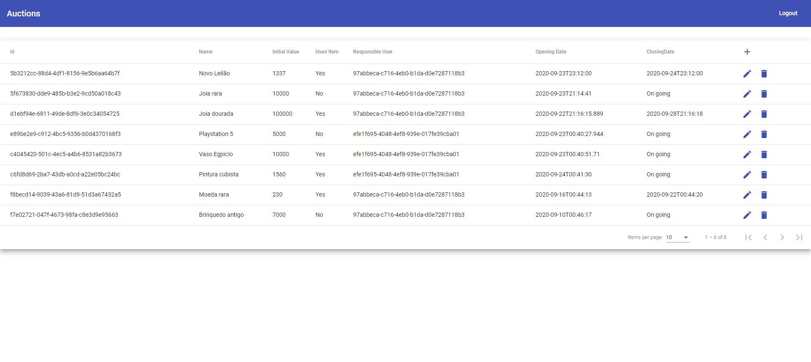

# Auction App

Está aplicação permite listar, criar, editar e deletar varios leilões



# Utilização

A aplicação utiliza Docker e Docker Compose para a criação e orquestração dos containers do servidor e do cliente web.

Utilize o comando abaixo para a inicialização dos containers:

```bash
docker-compose up --build
```

Para acessar o cliente utilize este link: [http://localhost:4200](http://localhost:4200)

# Autenticação

Utilize o usuário abaixo para acessar a aplicação:

email: admin@totvs.com.br

senha: 123456

# Melhorias

Citarei aqui algumas melhorias que a aplicação poderia ter:
  - Mostrar o nome do usuário na tabela, ao invés de seu id.
  - Na criação e edição de leilões, mostrar uma lista com usuários na seleção do responsável pelo leilão, ao invés de mostrar inserir o seu id.
  - Melhorar a validação dos campos na criação e edição de leilões
  - Formatar a data de abertura e fechamento do leilão
  - Adicionar testes